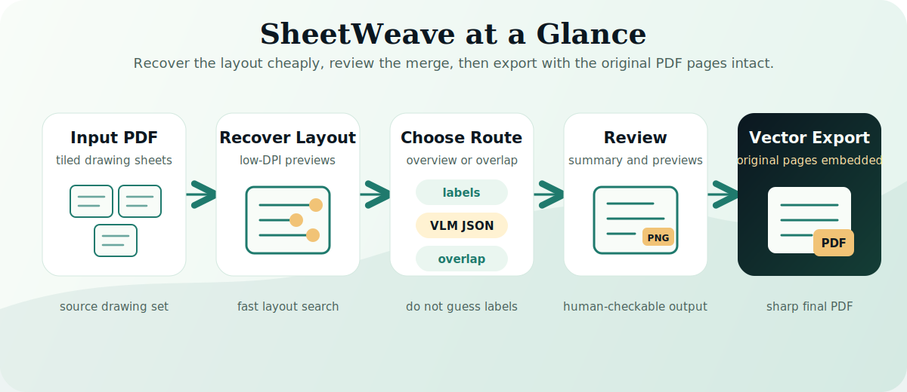
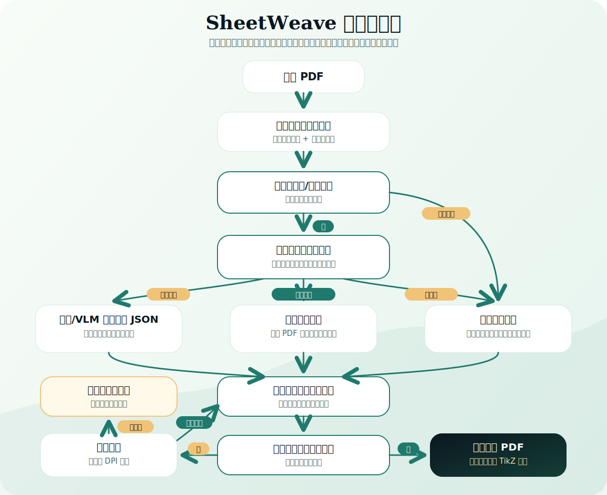

<p align="center">
  <picture>
    <source media="(prefers-color-scheme: dark)" srcset="https://raw.githubusercontent.com/WorkHaH/SheetWeave/main/assets/sheetweave-banner.svg">
    
  </picture>
</p>

<p align="center">
  <a href="README.md">English</a> | <a href="README.zh-CN.md">简体中文</a>
</p>

<p align="center">
  <a href="LICENSE"></a>
  
  
  
</p>

<h1 align="center">SheetWeave</h1>

<p align="center">
  把分块图纸 PDF 编织成一张完整的矢量 PDF。
</p>

---

SheetWeave 是一个 agent skill。你只需要把图纸 PDF 交给 agent，要求它使用 `$sheetweave`；skill 会提供图纸布局恢复、脚本工具和结果检查流程，帮助 agent 输出完整的矢量 PDF。

<p align="center">
  
</p>

## 🧭 它解决什么问题？

很多施工、建筑、工程图纸 PDF 会被拆成多张局部图纸。真正困难的地方不只是把图片贴起来，而是判断每一张局部图纸在整体图纸中的位置，同时让最终结果保持矢量清晰度。

| 你的情况 | SheetWeave 帮 agent 做什么 |
| --- | --- |
| PDF 里有缩略图/总览图 | 优先检查最可能的总览页，通常是第一页或最后一页。 |
| 总览图标号能被代码读取 | 用图纸编号、数字标号自动匹配局部页面。 |
| 标号人眼可见，但代码获取不到 | 让视觉大模型或人工读取标号，生成 layout JSON。 |
| PDF 里没有可用总览图，或总览图真的没有标号 | 使用传统重叠区域匹配，建立相邻关系图。 |
| 有些图纸只通过很小重叠连接 | 只对疑难连接做高 DPI 桥接恢复，避免全量高 DPI 慢跑。 |
| 最终结果必须是矢量图 | 把原始 PDF 页面放到更大的 LaTeX/TikZ 画布中。 |

> SheetWeave 是图纸布局恢复 skill，不是栅格截图拼接器。

## 🟢 最简单的安装方式

直接打开你的 agent，对它说：

```text
请帮我安装 https://github.com/JoinferLI/SheetWeave-skill 这个 skill，然后用它把我的图纸 PDF 拼成一张完整的矢量 PDF。
```

```text
Please install the SheetWeave skill from https://github.com/JoinferLI/SheetWeave-skill, then use it to merge my drawing PDF into one vector PDF.
```

## ⚙️ 手动安装

```bash
npx skills add JoinferLI/SheetWeave-skill
```

或直接克隆：

```bash
git clone https://github.com/JoinferLI/SheetWeave-skill.git ~/.agents/skills/sheetweave
```

安装后重启或刷新你的 agent。

## 💬 直接让 agent 使用它

```text
用 $sheetweave 处理这个 PDF，把里面的局部图纸拼成一张完整的矢量 PDF：./drawings.pdf
```

```text
Use $sheetweave to merge this drawing PDF into one vector PDF: ./drawings.pdf
```

## 🧵 工作流程 — 决策流程图

<p align="center">
  
</p>

1. **渲染预览** — 低分辨率页面图片 + 提取的文本，用于快速布局恢复。
2. **检查总览图** — 通常是第一页或最后一页。机器可读标号自动建立页面到区域的映射。
3. **选择路线**：
   - **机器可读标号** → 自动标号映射
   - **人眼可见标号** → 人工或 VLM layout JSON → `--overview-layout-json` 重新运行
   - **无总览图 / 无标号** → 重叠区域相邻匹配
4. **构建关系图并求解位置** — 选定的边变成页面变换。
5. **单个连通组件？** → **矢量合成 PDF**（原始页面嵌入 TikZ 画布）
6. **仍断开？** → **桥接恢复**（定向高 DPI 检查）→ 重新求解
7. **未解决组件** → **分组输出和诊断**（保留诊断信息）

## 📦 输出结构

```text
output/run/
  summary.json                 # 页面映射、边、组件、最终输出路径
  final/
    full-merged.pdf            # 成功合成单组件时的矢量结果
    full-merged.tex            # 生成矢量 PDF 的 LaTeX/TikZ 源文件
    full-merged.png            # 仅用于检查的栅格预览图
    layout-contact.png         # 总览图引导成功时的页面顺序检查图
  groups/group-XX/             # 仍存在多个断开组件时的分组输出
  vlm-request.json             # 总览图映射需要人工/VLM 帮助时生成
```

## 🔍 检查结果

先检查 `summary.json` 和 PNG 预览图，再把矢量 PDF 视为最终结果。

## 🛠️ 运行环境

| 依赖 | 用途 |
| --- | --- |
| Python 3.10+ | 运行内置脚本。 |
| `numpy`, `opencv-python`, `Pillow`, `pypdf` | 图像匹配和 PDF 操作。 |
| `pdfinfo`, `pdftoppm`, `pdftotext` | PDF 元信息、预览渲染、文本提取。 |
| `pdflatex` | 最终矢量 PDF 组装。 |

```bash
pip install -r scripts/requirements.txt
```

## 👁️ 人工 / VLM 总览图映射

当标号人眼可见但代码无法稳定读取时，读取 [`references/overview_layout_prompt.md`](references/overview_layout_prompt.md)，让视觉模型或人工把标号映射到 PDF 页面，然后用 `--overview-layout-json` 重新运行。如果总览图真的没有标号，走传统重叠匹配路线。

## ✅ 质量标准

- 图纸集连通时生成单个 `final/full-merged.pdf`
- 通过嵌入原始 PDF 页面保持矢量输出
- `summary.json` 中记录可审计的边
- 保留检查产物，方便人工验证
- 失败时优雅退化为分组或 VLM 请求

## 🗂️ 仓库结构

```text
sheetweave/
  SKILL.md                         # agent 加载的 skill 入口
  README.md                        # 英文文档
  README.zh-CN.md                  # 中文文档
  assets/
    sheetweave-overview.svg        # 五步工作流概览图
    sheetweave-decision-flow.svg   # 详细决策流程图
  agents/openai.yaml               # Codex UI 元数据
  scripts/
    sheetweave.py                  # 主要辅助脚本
    merge_drawings.py              # 重叠评分
    merge_pdf_drawings.py          # PDF 辅助逻辑
    vector_pdf_export.py           # 矢量组装
    requirements.txt               # Python 依赖
  references/
    overview_layout_prompt.md      # VLM/人工映射提示词
```

## ⚠️ 当前限制

- 超大画布可能会触发热分发版页面尺寸限制。
- 推断桥接边属于几何推断；关键场景请检查 `summary.json` 和 `full-merged.png`。
- 仓库刻意不包含真实图纸 PDF 和生成结果。
